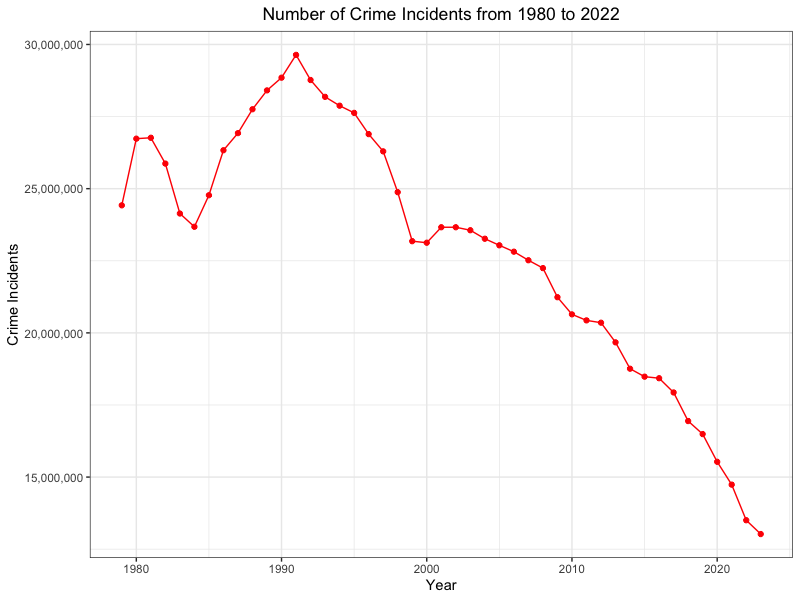
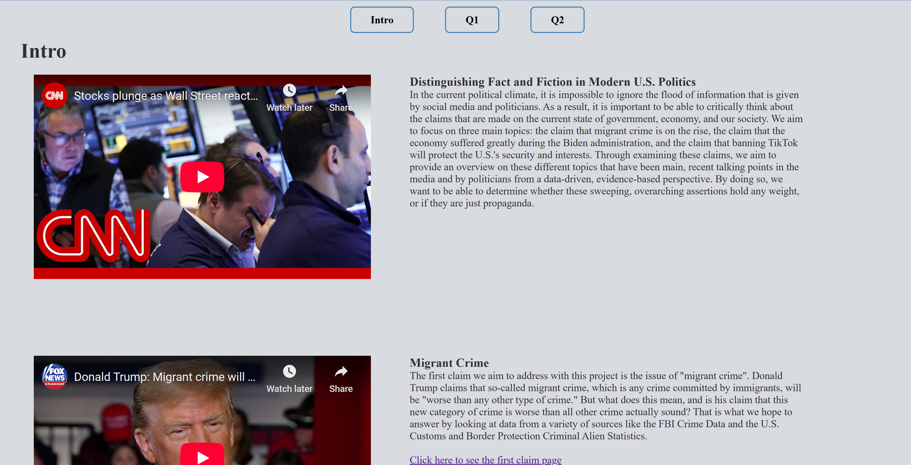
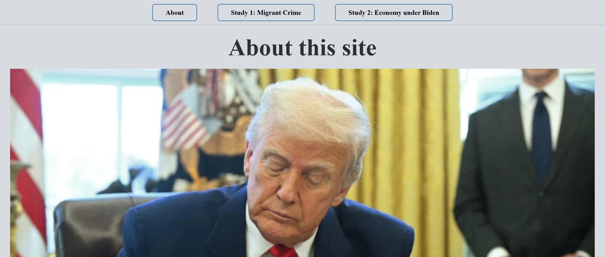
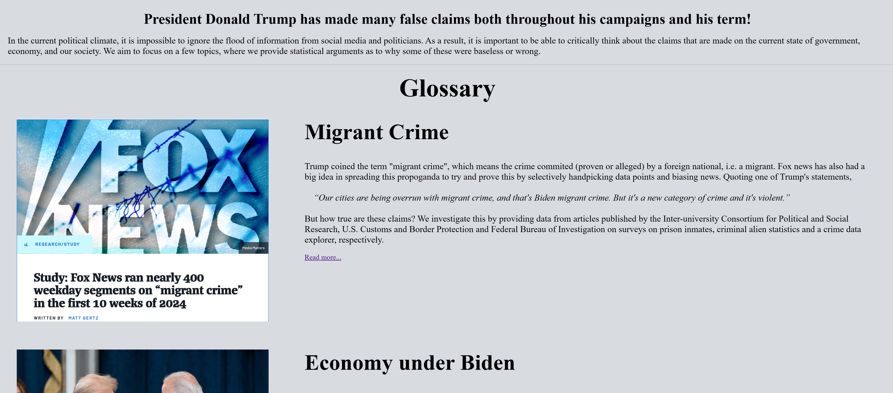
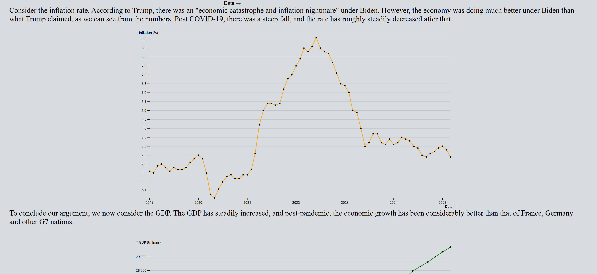
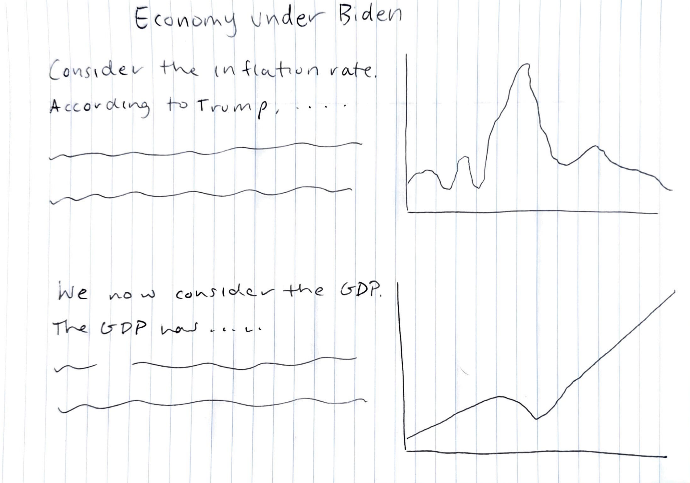

# CS 571 Project: Distinguishing Fact and Fiction in Modern U.S. Politics

## Project Metadata

- Email addresses:
  - jcedrone@umass.edu
  - akhurmi@umass.edu
  - vsenabunyari@umass.edu
- Spire IDs:
  - 33176603 - Danny Cedrone
  - 33053216 - Aditya Khurmi
  - 32873540 - Vutjiya Senabunyarithi
- Project Repository Link: [https://github.com/Vutjiya/cs-571-project](https://github.com/Vutjiya/cs-571-project)

# Original Project Proposal

## Background and Motivation

In the current political climate, it is impossible to ignore the flood of information that is given by social media and politicians. As a result, it is important to be able to critically think about the claims that are made on the current state of government, economy, and our society. We aim to focus on three main topics: the claim that migrant crime is on the rise, the claim that the economy suffered greatly during the Biden administration, and the claim that banning TikTok will protect the U.S.'s security and interests. Through examining these claims, we aim to provide an overview on these different topics that have been main, recent talking points in the media and by politicians from a data-driven, evidence-based perspective. By doing so, we want to be able to determine whether these sweeping, overarching assertions hold any weight, or if they are just propaganda.

## Project Objectives

The primary questions we are trying to answer with our visualization are tangential to the three topics of focus listed in the previous section: is the claim that migrant crime is on the rise accurate, is the claim that the economy suffered greatly during the Biden administration factual, and is the claim that banning TikTok will protect the U.S.'s security and interests grounded in truth. However, our goal for this project is verify claims made by politicians and in the media through data-driven and statistical methods. Rather than appealing to pathos, we aim to ground our claims with the data that is collected and the analyses conducted. In doing this, we hope to get closer to an objective truth based on the gather data and the visualizations sourced from the data.

## Data

The datasets that we are going to be using for the migrant crime claim are

- [Survey of Prison Inmates (2016)](https://www.icpsr.umich.edu/web/ICPSR/studies/37692/variables) which contains the answers to a questionnaire given to state and federal inmates. Some of the questions on the survey include the inmate's current age, race/Hispanic origin, U.S. citizenship status. We chose these data because it will help us estimate the rate at which migrant commit crimes and are in prison.
- [Criminal Alien Statistics](https://www.cbp.gov/newsroom/stats/cbp-enforcement-statistics/criminal-noncitizen-statistics) which contains a summary of the number of criminal alien arrests made by the U.S. Boarder Patrol in the years 2017-2025. We chose these data because we could use these statistics to compare the number of criminal alien arrests to the number of U.S. citizen arrests for each type of crime committed.
- [FBI Crime Data](https://cde.ucr.cjis.gov/LATEST/webapp/#/pages/downloads) which contains the National Incident-Based Reporting System (NIBRS). The NIBRS tables contain data that are voluntarily submit by different cities, universities, colleges, counties, states, tribal, and federal law enforcement agencies. Some of these tables include crime statistics and information on the victims, offenders, arrestees, locations, type of weapon, state, and time of day. By using the data from these tables we can estimate the number of crime committed in the U.S. at both the state and federal level and compare them to the crime rates of migrants to see if there is a difference between them.

The datasets that we are going to be using for the claim on the economy under Biden are

- [Bureau of Economic Analysis (DPI)](https://www.bea.gov/data/income-saving/disposable-personal-income) which contains datasets on the amount of the average disposable personal income (DPI) for people in the U.S. We chose these data because DPI is a key indicator of the strength of the economy. If people have more disposable income, then that is usually indicative of a strong economy.
- [U.S. Bureau of Labor Statistics (Unemployment Rate)](https://www.bls.gov/data/) which contains datasets on local area unemployment data and statistics on the federal and state level. We chose these data because unemployment rate is also a strong indicator of the health of the economy. If the unemployment rate in the U.S. was high during the Biden presidency, then that would imply that the economy was in poor condition.
- [Bureau of Economic Analysis (GDP)](https://www.bls.gov/lau/tables.htm#stateaa) which contains datasets on the U.S. GDP. We chose these data because GDP is a reliable indicator of the state of the economy. If the U.S. GDP was growing for a period of time, then that is indicative of a strong economy.
- [U.S. Bureau of Labor Statistics (CPI)](https://www.bls.gov/data/) which contains datasets on consumer price index, a measure of the average change over time in the prices paid by urban consumers for a market basket of consumer goods and services. Again, we chose this dataset since CPI is helpful in determining whether the health of the U.S. economy is in good condition. If the consumer price index is high, then that would suggest that the U.S. is experiencing inflation, which is a sign of an unhealthy economy.

## Data Processing

In terms of data processing, we expect that there will be some data cleaning involved given the amount of datasets that we will be using. In order to preform the data cleaning tasks, we will be using R or Python. Some of the cleaning tasks we expect would be changing variable name, getting rid of unnecessary headers, dropping irrelevant columns, and getting rid of `NA` values in each row/observation. Also, a few of the derived attributes we are creating are the net percent change in DPI, GDP, CPI, and unemployment rate in the U.S. By looking at the percent net change, we would be able to analysis trend in the economy and determine whether the economy was growing under Biden and the claims that the economy was worse under his presidency was inaccurate. In addition, we are working will many datasets, and as such, we will need to merge them in order to analyze the data in its entirety. In order to do this, we will perform several joins on the individual datasets after we have cleaned and transformed them to be compatible to join.

## Visualization Design

{ width=50% }{ width=50% }

{ width=33% }{ width=33% }{ width=33% }

{ width=50% }{ width=50% }

## Must-Have Features

For must-have features, we want to be able to include a thorough analysis of each of our claims, which would entail utilizing a variety of visualizations culminating to tell one story. In particular, we anticipate using many graphs such as line and bar graphs to show percent change over time. Our main goal is to have at least 2 visualizations per question. We will discuss the process of deciding on those visualizations later in our process book. In addition, we also want the visualization to tell a story through scrollytelling. This is an important part of our visualization as it will allow us to present our evidence in a logical order and ensure that the viewer is engaged with our content. We also need to have an introduction to the project overall, as well as a brief introduction/context for each topic. Finally, we feel it is a requirement to have at least 2 of the 3 topics we have chosen, and the third will be a stretch goal, which we will determine the feasibility of as the project progresses.

## Optional Features

Many of our optional features focus on aesthetics, as we feel the argument is the most crucial part to include, followed by the presentation which can support the argument and engage the viewer. We hope to be able to include a choropleth of the United States and allow the viewer to click on each state to view different statistics (for the claim about migrant crimes). Our first priority is to include data for the United States as a whole, and then if we are able to include data from each individual state to allow some interactivity. For more interactivity, we hope to include features which allow the user to click on/hover over bar graphs to display the specific number. This could also be a useful accessibility tool, so we hope to include it. Lastly, we hope to add some animations to the static visuals as the user scrolls. These will be in addition to the scrollytelling, and will make the site more engaging and visually appealing.

## Project Schedule

Week 1: Initial research and forming arguments

Week 2: Finalizing data sources, cleaning data

Week 3: Set up base site and introduction page

Week 4: Work on 1st topic page

Week 5: Project Milestone (April 4th): 95% of introduction done, 75% of 1st topic done

Week 6: Finish 1st topic and introduction

Week 7: Feedback (April 16th): Start 2nd topic

Week 8: Finalize 2nd topic, final bug fixes

Week 9: Final UI edits, Screencast (May 2nd)

Week 10: Finalize process book

Week 11: Final Deadline (May 12th)

# Project Update: Milestone (April 13 2025)

- Overview and Motivation:
  - In the current political climate, it is impossible to ignore the flood of information that is given by social media and politicians. As a result, it is important to be able to critically think about the claims that are made on the current state of government, economy, and our society. We aim to focus on two main topics: the claim that migrant crime is on the rise, and the claim that the economy suffered greatly during the Biden administration. Through examining these claims, we aim to provide an overview on these different topics that have been main, recent talking points in the media and by politicians from a data-driven, evidence-based perspective. By doing so, we want to be able to determine whether these sweeping, overarching assertions hold any weight, or if they are just propaganda.
- Related Work:
  - For the format of our visualizations, we were inspired by the New York Times’ effective use of scrollytelling, particularly in this article about the fire at Notre Dame. We hope to use scrollytelling later in the project as this was a very impactful visualization. We were also inspired by the U.S. Treasury’s FiscalData site. It’s a very simple site, but we drew inspiration from it because it utilizes several small, easily understood visualizations to answer many questions at once and give a larger picture, showing that sometimes less is more. It also has separate pages for going more in depth into each category, allowing for accountability and analysis.
- Questions:
  - By using data visualizations, we want to see how well the claims mentioned above hold up under scrutiny. We want to answer questions about the rates of crimes committed by foreign-born individuals living in the US, and about the economy, and how it compared under the Biden and Trump administrations. For our own purposes, we also have another set of questions we hope to answer throughout this project. We hope to learn for ourselves how to go about fact checking claims made by politicians, especially those made during a campaign season. We also hope to understand how to make compelling visualizations that will encourage people to think deeper about the claims we are addressing. Politicians work hard to appeal to the public, so we feel it’s important to do the same, even when the truth is inconvenient.

Data: Include information about the source, how you collected it (e.g., web scraping), cleaning methods, etc.

- From our initial proposal to use data from the Survey of Prison Inmates (2016) and the Criminal Alien Statistics, we found that the data that pertains to immigration status for the prison inmates is suppressed due to privacy laws. As a result, we are not able to use the data in our analysis for our migrant crime topic. Immigrant crime statistics and data is very scarce, and in the process of looking for more datasets, we found out that every state does not list immigration status in their crime statistics report or datasets except for Texas. In addition, we realized that the Criminal Alien Statistics only includes arrests for migrants at the border, which is not the focus of our analysis. As a result, we have only one dataset from our original proposal that we can use, so instead we have decided to focus on our second topic for the time being (the economy during the Biden administration) while we try to find a solution to this issue.
- In terms of our second topic, we have completed cleaning the data, using R, and have finished a few visualizations for our website using Observable Plot.

Exploratory Data Analysis: What visualizations did you use to initially look at your data? What insights did you gain? How did these insights inform your design?

- In our exploratory data analysis, for the dataset we had for national crime statistics, we made a prototype visual on the total number of incidents of violent, property, and sexual crimes and murder in the US.

From this plot, we see that the overall crime rates have been decreasing since the 1990s and there has not been a rise in crime during the time that Fox News claimed that there was a "Migrant Crime wave".

Design Evolution:

- At this time our design choices remain about the same as they did for the project proposal. The site in its current state acts as a proof of concept for a three-fold approach to the visualization, with three pages of the site acting as the intro page and the two claims we will look into. Since our project relies on several smaller visualizations to tell a story rather than a single large visualization, we needed to take that into consideration when planning our design, as many of our defining features rely on the layout of the site rather than the individual visualizations. We thought about using scrollytelling to create one long story starting from the introduction and moving through each topic, however we decided that that could be overwhelming and harder to navigate. We believe that the site design we have now adds the most interactivity while still remaining usable.

Initial site prototype\

Current site design\

Current page 2 (Economy under Biden)\

Sketch of posible future design\

Having the text and charts be aligned horizontally may improve readability and visual appeal.

- Implementation:
  - We consider our site as a whole to function as our larger visualization, which is then broken into smaller parts where we can explore the data through charts and graphs. The interactivity feature of our site allows the user to switch between topics. As mentioned above, this is our alternative to scrollytelling for the whole project. It gives the user some interactivity and allows them to move through the project without sacrificing overall visual appeal and usability. In the second half of the project, we plan to add more interactive elements within the smaller individual visualizations. We haven’t finalized these ideas yet, but they may come in the form of an interactive choropleth of the United States.  
- Evaluation:
  - At this point in the project our main focus was on getting the site up and running, and then in the second half focusing on the data exploration and finalizing the visualizations. We will have more to say in this area towards the end of the project. Our next biggest step, and the area where we will need to focus the most on, is the Migrant Crime section. We met our goal of having the intro plus one study page done by the milestone, but we ran into some issues when collecting data for the migrant crime section due to privacy laws. We also hope to use more interactive and/or visually appealing elements to make our story more compelling, since the site is fairly basic at this point.